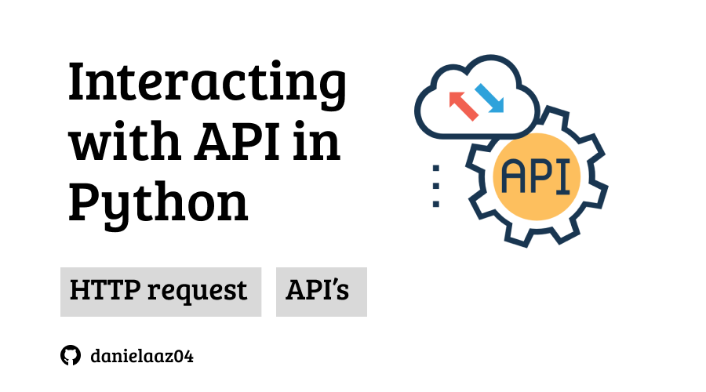

# Spotify API Analysis Project: Track Popularity vs Duration

A hands-on project focused on API integration, data analysis, and statistical modeling using real-world music data from Spotify. This project demonstrates the end-to-end process of connecting to external APIs, extracting meaningful insights, and performing statistical analysis to understand relationships between track characteristics.



## Project Overview
This project explores the relationship between track duration and popularity using Spotify's Web API. Through statistical analysis and data visualization, we investigate whether there's a correlation between how long a song is and how popular it becomes with listeners.

**Key topics covered include:**
- API authentication and data retrieval using the Spotify Web API
- Statistical analysis with ordinary least squares (OLS) regression
- Data visualization and interpretation
- Working with real-world music streaming data
- Best practices for API integration and data analysis

See instructions in the [INSTRUCTIONS.md](INSTRUCTIONS.md) file for original assignment description.


## Getting Started

## Spotify API Setup
1. Go to the [Spotify Developer Dashboard](https://developer.spotify.com/dashboard)
2. Create a new app to get your Client ID and Client Secret

### Option 1: GitHub Codespaces (Recommended)

1. **Fork the Repository**
   - Click the "Fork" button on the top right of the GitHub repository page
   - 4Geeks students: set 4GeeksAcademy as the owner - 4Geeks pays for your codespace usage. All others, set yourself as the owner
   - Give the fork a descriptive name. 4Geeks students: I recommend including your GitHub username to help in finding the fork if you loose the link
   - Click "Create fork"
   - 4Geeks students: bookmark or otherwise save the link to your fork

2. **Set up your Spotify API credentials using Codespace secrets**:
   - Go to your GitHub repository settings
   - Navigate to "Secrets and variables" → "Codespaces"
   - Add two repository secrets:
     - `CLIENT_ID`: Your Spotify client ID
     - `CLIENT_SECRET`: Your Spotify client secret
   - These will automatically be available as environment variables in your Codespace

3. **Create a GitHub Codespace**
   - On your forked repository, click the "Code" button
   - Select "Create codespace on main"
   - If the "Create codespace on main" option is grayed out - go to your codespaces list from the three-bar menu at the upper left and delete an old codespace
   - Wait for the environment to load (dependencies are pre-installed)

4. **Start Working**
   - Write your code in `src/assignment.py`
   - Run your code with the command `python src/assignment.py`

GitHub Codespaces provides a complete VS Code environment in your browser with all required extensions and packages pre-installed.

### Option 2: Local Installation

1. **Prerequisites**
   - Git
   - Python >= 3.10

2. **Fork the repository**
   - Click the "Fork" button on the top right of the GitHub repository page
   - Optional: give the fork a new name and/or description
   - Click "Create fork"

3. **Clone the repository**
   - From your fork of the repository, click the green "Code" button at the upper right
   - From the "Local" tab, select HTTPS and copy the link
   - Run the following commands on your machine, replacing `<LINK>` and `<REPO_NAME>`

   ```bash
   git clone <LINK>
   cd <REPO_NAME>
   ```

4. **Set Up Environment**
   - Create virtual environment

   ```bash
   python -m venv .venv
   ```

   - Set your Spotify API credentials as environment variables in the virtual environment by adding the following in `.venv/bin/activate`:

   ```bash
   export CLIENT_ID="your_spotify_client_id"
   export CLIENT_SECRET="your_spotify_client_secret"
   ```

   - Activate the virtual environment & install dependencies:
   ```bash
   source .venv/bin/activate
   pip install -r requirements.txt
   ```

5. **Start Working**
   - Write your code in `src/assignment.py`
   - Run your code with the command `python src/assignment.py`


## Project Structure
```
├── .devcontainer/          # Codespace/development container configuration
├── assets/                 # Generated plots and preview images
│   ├── duration_plot.jpg   # Output visualization
│   ├── preview.png         # Project preview image
│   ├── spotify_1.PNG       # Documentation screenshots
│   └── spotify_2.png       # Documentation screenshots
│
├── src/                    # Source code
│   └── assignment.py       # Your code goes here
│   └── solution.py         # Reference solution
│
├── .gitignore              # Files/directories not tracked by git
├── requirements.txt        # Python dependencies
├── INSTRUCTIONS.md         # Assignment instructions
└── README.md               # Project documentation
```


## Learning Objectives

### API Integration & Data Acquisition
- Connect to external APIs using proper authentication methods
- Extract and process JSON data from REST API endpoints
- Handle API responses and error cases gracefully

### Statistical Analysis & Visualization
- Perform regression analysis to identify relationships between variables
- Create meaningful visualizations to communicate findings
- Interpret statistical results and p-values


Example insights you might discover:
- Whether longer songs tend to be more or less popular
- The strength of the relationship between duration and popularity
- Statistical significance of any observed patterns

## Technologies Used
- **Python 3.11**: Core programming language
- **Spotipy**: Python library for Spotify Web API
- **NumPy**: Numerical computing and array operations
- **Matplotlib**: Data visualization and plotting
- **Statsmodels**: Statistical modeling and regression analysis
- **Spotify Web API**: Music streaming data and metadata

## Contributing
This project is designed for educational purposes. Contributions to improve the analysis, add new features, or enhance explanations are welcome:

1. Fork the repository
2. Create a feature branch
3. Make your improvements
4. Submit a pull request