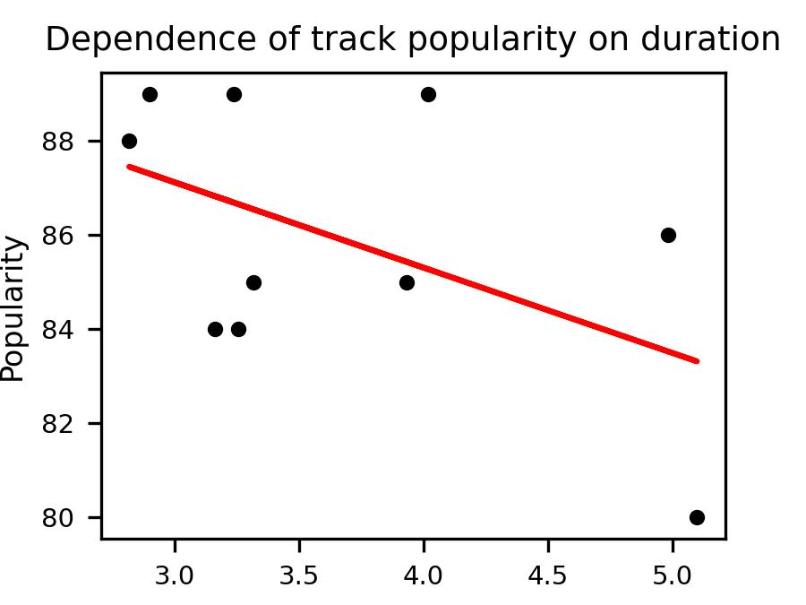

# Spotify API Analysis Project: Track Popularity vs Duration

A hands-on project focused on API integration, data analysis, and statistical modeling using real-world music data from Spotify. This project demonstrates the end-to-end process of connecting to external APIs, extracting meaningful insights, and performing statistical analysis to understand relationships between track characteristics.


## Project Overview
This project explores the relationship between track duration and popularity using Spotify's Web API. Through statistical analysis and data visualization, we investigate whether there's a correlation between how long a song is and how popular it becomes with listeners.

**Key topics covered include:**
- API authentication and data retrieval using the Spotify Web API
- Statistical analysis with ordinary least squares (OLS) regression
- Data visualization and interpretation
- Working with real-world music streaming data
- Best practices for API integration and data analysis

See instructions in the [INSTRUCTIONS.md](INSTRUCTIONS.md) file for original assignment description.

## Learning Objectives
### API Integration & Data Acquisition
- Connect to external APIs using proper authentication methods
- Extract and process JSON data from REST API endpoints
- Handle API responses and error cases gracefully

### Statistical Analysis & Visualization
- Perform regression analysis to identify relationships between variables
- Create meaningful visualizations to communicate findings
- Interpret statistical results and p-values

## Getting Started

## Spotify API Setup
1. Go to the [Spotify Developer Dashboard](https://developer.spotify.com/dashboard)
2. Create a new app to get your Client ID and Client Secret

### Using GitHub Codespaces (Recommended)
Launch this project instantly in a fully configured cloud development environment:

1. Set up your Spotify API credentials using Codespace secrets:
   - Go to your GitHub repository settings
   - Navigate to "Secrets and variables" → "Codespaces"
   - Add two repository secrets:
     - `CLIENT_ID`: Your Spotify client ID
     - `CLIENT_SECRET`: Your Spotify client secret
   - These will automatically be available as environment variables in your Codespace

2. Click the green "Code" button on the GitHub repository
3. Select the "Codespaces" tab
4. Click "Create codespace on main"
5. Wait for the environment to initialize (all dependencies will be installed automatically)
6. Open `src/app.py` to start the analysis

GitHub Codespaces provides a complete VS Code environment in your browser with all required extensions and packages pre-installed.

### Local Installation
#### Prerequisites
- Python 3.11+
- Spotify Developer Account and API credentials
- Git (for cloning the repository)

#### Steps
Clone the repository:
```bash
git clone https://github.com/4GeeksAcademy/gperdrizet-interacting-with-api-python-project-tutorial.git
cd gperdrizet-interacting-with-api-python-project-tutorial
```

Create a virtual environment (recommended):
```bash
python -m venv .venv
```

Set up your Spotify API credentials in the virtual environment:
```bash
# Add your Spotify credentials to the activation script
echo 'export CLIENT_ID="your_spotify_client_id"' >> .venv/bin/activate
echo 'export CLIENT_SECRET="your_spotify_client_secret"' >> .venv/bin/activate

# On Windows, use:
# echo 'set CLIENT_ID=your_spotify_client_id' >> .venv\Scripts\activate.bat
# echo 'set CLIENT_SECRET=your_spotify_client_secret' >> .venv\Scripts\activate.bat
```

Activate the virtual environment:
```bash
source .venv/bin/activate  # On Windows: .venv\Scripts\activate
```

Install dependencies:
```bash
pip install -r requirements.txt
```

Run the project:
```bash
python src/app.py
```

## Project Structure
```
├── assets/                 # Generated plots and preview images
│   ├── duration_plot.jpg   # Output visualization
│   ├── preview.png         # Project preview image
│   ├── spotify_1.PNG       # Documentation screenshots
│   └── spotify_2.png       # Documentation screenshots
├── src/                    # Source code
│   └── app.py              # Main analysis script
├── requirements.txt        # Python dependencies
├── INSTRUCTIONS.md         # Assignment instructions and missions
└── README.md               # Project documentation
```

## Analysis Overview
### Data Collection
- Connect to Spotify Web API using client credentials flow
- Retrieve top tracks for a specific artist
- Extract track metadata including name, popularity, and duration

### Statistical Analysis
- Convert duration from milliseconds to minutes for better interpretability
- Perform ordinary least squares (OLS) regression analysis
- Calculate correlation between track duration and popularity
- Generate statistical summary including p-values and confidence intervals

### Data Visualization
- Create scatter plot showing relationship between duration and popularity
- Add regression line to visualize the trend
- Include statistical significance information on the plot
- Save high-resolution plot for presentation

## Key Concepts Covered
- REST API integration and authentication
- JSON data parsing and extraction
- Statistical modeling with OLS regression
- Data visualization with matplotlib
- Statistical significance testing
- Professional project structure and workflow

## Sample Output
The analysis generates:
- Statistical summary of the regression model
- P-value indicating statistical significance
- Visualization saved as `assets/duration_plot.jpg`



Example insights you might discover:
- Whether longer songs tend to be more or less popular
- The strength of the relationship between duration and popularity
- Statistical significance of any observed patterns

## Technologies Used
- **Python 3.11**: Core programming language
- **Spotipy**: Python library for Spotify Web API
- **NumPy**: Numerical computing and array operations
- **Matplotlib**: Data visualization and plotting
- **Statsmodels**: Statistical modeling and regression analysis
- **Spotify Web API**: Music streaming data and metadata

## Contributing
This project is designed for educational purposes. Contributions to improve the analysis, add new features, or enhance explanations are welcome:

1. Fork the repository
2. Create a feature branch
3. Make your improvements
4. Submit a pull request